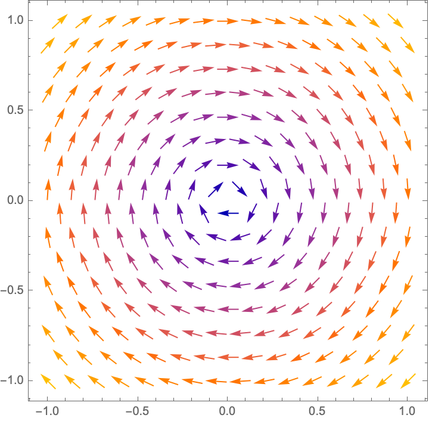
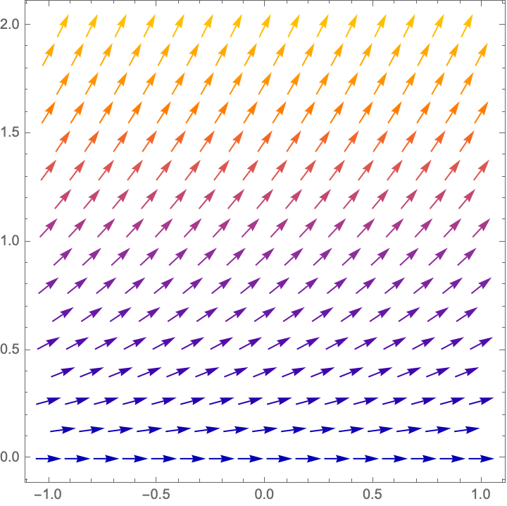

# HW02

## HW2.1. First Order Linear Equation

Solve the first order linear initial value problem

$\qquad\frac{dy}{dx} + 2 y =  8 x^{2} - 9 x - 2\qquad y(0)=0$

Ans: $\qquad y(x)$ = $4 x^{2} - \frac{17 x}{2} + \frac{13}{4} - \frac{13 e^{- 2 x}}{4}$

## HW2.2. First Order Linear Equation

 Find the general solution to the first order linear differential equation

 $\qquad\frac{dy}{dt} + 2 y =  \cos (2 t)$

 Please use $A$ to denote the constant of integration. Recall that $e^{11 t}$ can be represented as exp(11\*t) or as e^(11\*t). Click the question mark in the answer panel for more information.

Ans: $\qquad y(t)$ = $A e^{- 2 t} + \frac{\sin{\left(2 t \right)}}{4} + \frac{\cos{\left(2 t \right)}}{4}$

## HW2.3. First Order Linear Equation

 Solve the first order linear initial value problem

 $\qquad\frac{dy}{dx} + 4 y =  x^{3} + 8 x^{2} - 5 x + 2\qquad y(0)=0$

Ans: $\qquad y(x)$ = $\frac{x^{3}}{4} + \frac{29 x^{2}}{16} - \frac{69 x}{32} + \frac{133}{128} - \frac{133 e^{- 4 x}}{128}$

## HW2.4. First Order Linear Equation

 Solve the first order linear initial value problem

 $\qquad\frac{dy}{dx} + 4 y =  8 x + 6\qquad y(0)=0$

Ans: $\qquad y(x)$ = $2 x + 1 - e^{- 4 x}$

## HW2.5. First Order Linear Equation

 Find the general solution to the first order linear differential equation

 $\qquad\frac{dy}{dt} + 4 y =  \sin (3 t)$

 Please use $A$ to denote the constant of integration. Recall that $e^{11 t}$ can be represented as exp(11\*t) or as e^(11\*t). Click the question mark in the answer panel for more information.

Ans: $\qquad y(t)$ = $A e^{- 4 t} + \frac{4 \sin{\left(3 t \right)}}{25} - \frac{3 \cos{\left(3 t \right)}}{25}$

## HW2.6. Existence and Uniqueness theorem: Fill in the blanks

Complete the statement of the existence and uniqueness theorem.

The initial value problem $y' = f(y,t) ~~~y(t_0)=y_0$ has a unique solution if `f(y,t)` is `continuous` in a neighborhood of $(t_0,y_0)$. and if `df/dy` is `continuous` in a neighborhood of $(t_0,y_0)$.

## HW2.7. Existence and Uniqueness

Which of the following initial value problems is guaranteed to have a unique solution by the theorem covered in class?

- [ ] (a) $y' + y^{\frac13} = t~~~~~y(0)=0$
- [x] (b) $y y' + t^2 \sin(y) = 0 ~~~~~~~~y(0)=\pi$
- [ ] (c) $y y' + (1+t^2) \cos(y) = 0 ~~~~~~~~y(0)=0$
- [ ] (d) $y' = \frac{t+y}{t-y}~~~~~y(1)=1$
- [ ] (e) $y' + (1+t^2) \tan(y) = e^{-t} ~~~~~y(0)=\frac{\pi}{2}$

## HW2.8. Existence and Uniqueness

Which of the following initial value problems is guaranteed to have a unique solution by the theorem covered in class?

- [ ] (a) $y y' + \frac{(1+t^2)}{\cos(y^2)} = t ~~~~~~~~y(0)=0$
- [x] (b) $y' + y^{\frac75} = t~~~~~y(0)=0$
- [ ] (c) $y' = \frac{e^{t^2}}{y^2-3y+2}  ~~~~~y(0)=1$
- [ ] (d) $y' + y^{\frac15} = t~~~~~y(0)=0$
- [ ] (e) $y' = \frac{t+y}{t-y}~~~~~y(3)=3$

## HW2.9. Existence and Uniqueness

Does existence and uniqueness theorem guarantee that the initial value problem

$$
 \frac{dy}{dx} = \frac{x^2+y^2}{x^2 - y^2} \qquad y(1)=2
$$

has a unique solution?

- [ ] (a) There is not enough information given to decide.
- [ ] (b) The equation is not guaranteed to have a solution.
- [x] (c) The equation is guaranteed to have a unique solution.
- [ ] (d) The equation is guaranteed to have a solution; it is not guaranteed to be unique.

## HW2.10. Slope Fields

 

 Select the differential equation that best matches the slope field plotted above.
 (The horizontal axis is $t$ and the vertical one is $y$)

- [ ] (a) $\frac{dy}{dt} = \frac{y}{t}$
- [ ] (b) $\frac{dy}{dt} = \frac{t}{y}$
- [ ] (c) $\frac{dy}{dt} = -\frac{y}{t}$
- [x] (d) $\frac{dy}{dt} = -\frac{t}{y}$

## HW2.11. Slope Fields

 

 Select the differential equation that best matches the slope field plotted above.

- [ ] (a) $\frac{dy}{dt} = y(1-y)$
- [ ] (b) $\frac{dy}{dt} = 1-y$
- [ ] (c) $\frac{dy}{dt} = -y$
- [ ] (d) $\frac{dy}{dt} = y-1$
- [x] (e) $\frac{dy}{dt} = y$
