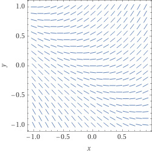
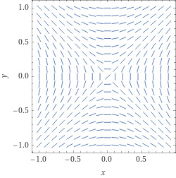
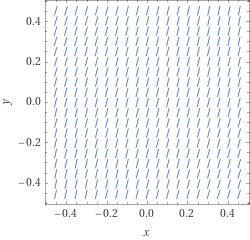
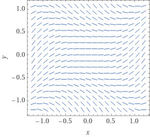
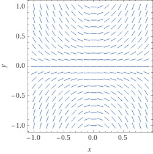

# Math 285 Quizzes

## Q01

Question 1: Quiz: Pineapple

 Does pineapple go on pizza?

- [ ] (a) Of course
- [ ] (b) Yes
- [ ] (c) Why not?
- [ ] (d) It's my pizza and I put whatever I want on it
- [x] (e) Absolutely not!

## Q02

Question 1: Identify separable equations

 Which of the following ordinary differential equations are separable equations?

(1) $\displaystyle \frac{d y}{d t} = \sin(y) \sin(t)$

(2) $\displaystyle\frac{d y}{d t} = \sin(yt)$

(3) $\displaystyle\frac{d y}{d t} = \frac{\sin(y)}{\sin(t)}$

- [ ] (a) (1) is, (2) is, (3) is
- [ ] (b) (1) is, (2) is, (3) is not
- [ ] (c) (1) is not, (2) is not, (3) is
- [ ] (d) (1) is not, (2) is, (3) is
- [ ] (e) (1) is, (2) is not, (3) is not
- [x] (f) (1) is, (2) is not, (3) is
- [ ] (g) (1) is not, (2) is, (3) is not

## Q03

Question 1: Identify the slope field

Identify the slope field of the equation

$$
\frac{dy}{dx} = y+x
$$

- [x] (a) 
- [ ] (b) 
- [ ] (c) 
- [ ] (d) 
- [ ] (e) 

## Q04

Question 1: Apply first order existence & uniqueness theorem

 Consider the following initial value problems

(1)

$$
\displaystyle \begin{cases} \displaystyle\frac{d y}{d t} = y^{1/3} \\ y(0)=0 \end{cases}
$$

(2)

$$
\displaystyle \begin{cases} \displaystyle\frac{d y}{d t} = y^{1/3} \\ y(1)=1 \end{cases}
$$

 What does the existence and uniqueness theorem tell us about these equations?

- [ ] (a) It tells us nothing about (1) and that (2) has a unique solution near $t=1,y=1.$
- [ ] (b) It guarantees that (1) has a solution near $t=0,y=0$ but not that it is unique and that (2) has a solution near $t=1,y=1$ but not that it is unique.
- [ ] (c) It tells us nothing about (1) and that (2) has a solution near $t=1,y=1$ but not that it is unique.
- [ ] (d) It guarantees that (1) has a unique solution near $t=0,y=0$ and it tells us nothing about (2).
- [x] (e) It guarantees that (1) has a solution near $t=0,y=0$ but not that it is unique and that (2) has a unique solution near $t=1,y=1.$
- [ ] (f) It guarantees that (1) has a solution near $t=0,y=0$ but not that it is unique and it tells us nothing about (2).
- [ ] (g) It guarantees that (1) has a unique solution near $t=0,y=0$ and that (2) has a solution near $t=1,y=1$ but not that it is unique.
- [ ] (h) It tells us nothing about (1) and it tells us nothing about (2).
- [ ] (i) It guarantees that (1) has a unique solution near $t=0,y=0$ and that (2) has a unique solution near $t=1,y=1.$

## Q05

Question 1: Find an integrating factor

 Which of the following functions would work as an integrating factor for the equation $\displaystyle\frac{d y}{d t} +2t y = \sin(t) $

- [x] (a) $\mu(t) = e^{t^2}$
- [ ] (b) $\mu(t) = e^{2t}$
- [ ] (c) $\mu(t) = e^{\sin(t)}$
- [ ] (d) $\mu(t) = \sin(t)$
- [ ] (e) $\mu(t) = e^{-\cos(t)}$

## Q06

Question 1: Complete into an exact equation

 Consider the equation $\displaystyle N(x,y) \frac{d y}{d x} + M(x,y)=0$

 If $N(x,y) = x^2+2xy,$ which of the following choices of $M(x,y)$ would make this an exact equation?

- [ ] (a) $M(x,y) = x^2y$
- [ ] (b) $M(x,y) = x^2+2xy$
- [ ] (c) $M(x,y) = x^2+y^2$
- [x] (d) $M(x,y) = 2xy+y^2$
- [ ] (e) $M(x,y) = (x-y)^2$

## Q07

Question 1: What type of equilibrium point is this?

 The first order autonomous equation $\displaystyle \frac{d y}{d x}= (y-4)(y+1)$ has an equilibrium point at $y=4.$

 What type of equilibrium point is this?

- [ ] (a) $y=4$ is an stable equilibrium point
- [ ] (b) It is impossible to tell
- [x] (c) $y=4$ is an unstable equilibrium point
- [ ] (d) $y=4$ is neither stable nor unstable

## Q08

Question 1: Apply Euler's method

 Consider the initial value problem

```math
\begin{cases}\displaystyle \frac{d y}{d t} = e^{ty} \\ y(0)=1 \end{cases}
```

 If you apply Euler's method with step size $\Delta t = 0.1,$ what is $y_1?$

- [ ] (a) $e^{1.1}$
- [ ] (b) $1.2707$
- [ ] (c) $1$
- [ ] (d) $e^{0.1}$
- [x] (e) $1.1$

## Q09

Question 1: Higher Order Linear Equation Existence

 Consider the initial value problem

```math
\begin{cases}\displaystyle \frac{d^3 y}{d t^3}+ \frac1{t-4}\frac{d^2 y}{d t^2}+\frac yt=0 \\ y(1)=1, \; y'(1)=2, \; y''(1) = -14 \end{cases}
```

 What is the largest interval on which we are guaranteed to have a unique solution?

- [ ] (a) $(-\infty, \infty)$
- [x] (b) $(0,4)$
- [ ] (c) $(0,\infty)$
- [ ] (d) $(-\infty, 4)$
- [ ] (e) $(-14,1)$

## Q10

Question 1: Wronskian

Which of the following is equal to the Wronskian $W(e^t, te^t)?$

- [x] (a) $e^{2t}$
- [ ] (b) $0$
- [ ] (c) $4$
- [ ] (d) $t$
- [ ] (e) $te^t$

## Q11

Question 1: Characteristic polynomial

Find the roots of the characteristic equation of $\displaystyle \frac{d^3y}{dt^3} - 4 \frac{d^2y}{dt^2} + 4\frac{dy}{dt}=0$

- [ ] (a) $0$ with multiplicity one, $-4$ with multiplicity one, $4$ with multiplicity one
- [ ] (b) $0$ with multiplicity three
- [ ] (c) $0$ with multiplicity one, $-2$ with multiplicity one, $2$ with multiplicity one
- [x] (d) $0$ with multiplicity one and $2$ with multiplicity two
- [ ] (e) $-4$ with multiplicity one, $4$ with multiplicity one

## Q12

Question 1: Constant Coefficient Linear ODE

 Find the general solution of $\displaystyle \frac{d^3y}{dt^3} - 4 \frac{d^2y}{dt^2} + 4\frac{dy}{dt}=0$

- [ ] (a) $y(t) = A + B e^{-4t} + C e^{4t}$ with $A,$ $B,$ and $C$ arbitrary constants
- [x] (b) $y(t) = A + B e^{2t} + C te^{2t}$ with $A,$ $B,$ and $C$ arbitrary constants
- [ ] (c) $y(t) = A e^{-4t} + B e^{4t}$ with $A$ and $B$ arbitrary constants
- [ ] (d) $y(t) = A + Bt + Ct^{2}$ with $A,$ $B,$ and $C$ arbitrary constants
- [ ] (e) $y(t) = A + B e^{-2t} + C e^{2t}$ with $A,$ $B,$ and $C$ arbitrary constants

## Q13

Question 1: Undetermined Coefficients

 Find the general solution of $\displaystyle \frac{d^3y}{dt^3} - 4 \frac{d^2y}{dt^2} + 4\frac{dy}{dt}=e^t$

- [ ] (a) $y(t) = A + B e^{2t} + C te^{2t}$ with $A,$ $B,$ and $C$ arbitrary constants
- [x] (b) $y(t) = e^t + A + B e^{2t} + C te^{2t}$ with $A,$ $B,$ and $C$ arbitrary constants
- [ ] (c) $y(t) = \ln(t) + A + B e^{2t} + C te^{2t}$ with $A,$ $B,$ and $C$ arbitrary constants
- [ ] (d) $y(t) = 17e^t + A + B e^{2t} + C te^{2t}$ with $A,$ $B,$ and $C$ arbitrary constants
- [ ] (e) $y(t) = e^t + A + B e^{-4t} + C e^{4t}$ with $A,$ $B,$ and $C$ arbitrary constants

## Q14

Question 1: Annihilator Method

 Which of the following is the simplest annihilator for the function $f(t) = \sin(3t)?$

- [ ] (a) $\frac{d^2}{dt^2}$
- [ ] (b) $\frac{d^2}{dt^2}+3$
- [ ] (c) $-\sin(3t)$
- [ ] (d) $\frac{d}{dt}-3\cos(3t)$
- [x] (e) $\frac{d^2}{dt^2}+9$

## Q15

Question 1: Variation of Parameters

 If we are given a function $f(t)$ and we want to find a particular solution of the equation $\frac{d^3y}{dt^3}+9\frac{dy}{dt} = f(t)$ using variation of parameters, then we should look for a particular solution of the following form:

- [x] (a) $y_p(t) = A(t) + B(t) \sin(3t) + C(t) \cos(3t)$
- [ ] (b) $y_p(t) = A + Bt + C\sin(3t)$
- [ ] (c) $y_p(t) = A+ Be^{3t}+Ce^{-3t}$
- [ ] (d) $y_p(t) = A(t) f(t) + 9B(t)$
- [ ] (e) $y_p(t) = A(t) \sin(3t) + B(t) \cos (3t) $

## Q17

Question 1: Undamped Vibrations

 Suppose a mass-spring system has a mass of 32 kg and involves a spring with spring constant $k= 64 \text{ kg/}\text{s}^2.$ What is the natural frequency of the system?

- [ ] (a) It is impossible to determine from these data
- [ ] (b) $64$
- [x] (c) $\sqrt{2} \text{ s}^{-1}$
- [ ] (d) $A\cos(\sqrt{\tfrac km}t)+B\sin(\sqrt{\tfrac km}t)$
- [ ] (e) $\sin(\omega t)$

## Q18

Question 1: Damped Vibrations

 Suppose a damped mass-spring system has a mass of 64 kg and involves a spring with spring constant $k= 64 \text{ kg/}\text{s}^2$ and that the damping coefficient is $\gamma = 64$ kg/s. Is the system overdamped, underdamped, or critically damped?

- [ ] (a) overdamped
- [ ] (b) critically damped
- [ ] (c) $64$
- [ ] (d) It is impossible to determine from these data
- [x] (e) underdamped

## Q19

Question 1: Electric Circuits

 Suppose we have an RC circuit governed by the equation $5\frac{dI}{dt} + \frac12I = V_0 \cos(t).$ What is the impedance of the circuit?

- [x] (a) $5-\frac i2$
- [ ] (b) It is impossible to determine from these data
- [ ] (c) $-V_0\cos(t)$
- [ ] (d) $5$
- [ ] (e) $V_0e^{it}$

## Q20

Question 1: Determinants

 What is the determinant of the matrix

```math
\begin{bmatrix} 0 & 1 & 1 & 1 \\ 1& 0 & 1& 1\\ 1& 1& 0 & 1\\ 1& 1&1&0 \end{bmatrix}?
```

- [ ] (a) It is impossible to determine from these data
- [ ] (b) $-1$
- [x] (c) $-3$
- [ ] (d) $1$
- [ ] (e) $3$

## Q21

Question 1: Row Operations

 What is the set of solutions to the equation

```math
\begin{bmatrix} 0 & 1 & 1 & 2 \\ 1& 0 & 1& 2\\ 1& 1& 0 & 2\\ 1& 1&1&3 \end{bmatrix} \begin{bmatrix}x \\ y \\ z \\ w\end{bmatrix} = \begin{bmatrix}0 \\ 0 \\ 0 \\ 0\end{bmatrix}?
```

- [ ] (a)

```math
\left\lbrace \begin{bmatrix} x\\y\\z\\w \end{bmatrix} = w\begin{bmatrix} 2 \\ 2 \\ 2 \\ 3 \end{bmatrix}: w \text{ arbitrary } \right\rbrace
```

- [x] (b)

```math
\left\lbrace \begin{bmatrix} x\\y\\z\\w \end{bmatrix} = w\begin{bmatrix} -1\\-1\\-1\\1 \end{bmatrix}: w \text{ arbitrary } \right\rbrace
```

- [ ] (c)

```math
\left\lbrace \begin{bmatrix} x \\ y \\ z \\ w \end{bmatrix} = w\begin{bmatrix} 1 \\ 1 \\ 1 \\ 1 \end{bmatrix}: w \text{ arbitrary } \right\rbrace
```

- [ ] (d)

```math
\left\lbrace \begin{bmatrix} x \\ y \\ z \\ w \end{bmatrix} = x\begin{bmatrix} 1 \\ 0 \\ 0 \\ 0 \end{bmatrix}+ y\begin{bmatrix} 0 \\ 1 \\ 0 \\ 0 \end{bmatrix}+ z\begin{bmatrix} 0 \\ 0 \\ 1 \\ 0 \end{bmatrix}+ w\begin{bmatrix} 0 \\ 0 \\ 0 \\ 1 \end{bmatrix}: x,y,z,w \text{ arbitrary } \right\rbrace
```

- [ ] (e)

```math
\left\lbrace \begin{bmatrix} x\\ y \\ z \\ w \end{bmatrix} = x\begin{bmatrix} 0 \\ 1 \\ 1 \\ 1 \end{bmatrix}+ y\begin{bmatrix} 1 \\ 0 \\ 1 \\ 1 \end{bmatrix}+ z\begin{bmatrix} 1 \\ 1 \\ 0 \\ 1 \end{bmatrix}+ w\begin{bmatrix} 2 \\ 2 \\ 2 \\ 3 \end{bmatrix}: x,y,z,w \text{ arbitrary } \right\rbrace
```

## Q22

Question 1: Eigenvalues

 Which of the following vectors is an eigenvector of the matrix

```math
\begin{bmatrix} 1 & 1\\ 0& 2\end{bmatrix}
```

 corresponding to the eigenvalue $2$?

- [ ] (a)

```math
\begin{bmatrix}0\\1\end{bmatrix}
```

- [ ] (b)

```math
\begin{bmatrix}1\\0\end{bmatrix}
```

- [ ] (c)

```math
\begin{bmatrix}0\\0\end{bmatrix}
```

- [x] (d)

```math
\begin{bmatrix}1\\1\end{bmatrix}
```

- [ ] (e)

```math
\begin{bmatrix}2\\0\end{bmatrix}
```

## Q23

Question 1: Eigenvalues

What are the eigenvalues of the matrix

```math
\begin{bmatrix} 1 & 1 & 0\\ 2 & 3 & 1 \\ 0 & 1 & 1\end{bmatrix}
```

?

- [ ] (a) $\lambda = 0, 0, 4$
- [x] (b) $\lambda = 0, 1, 4$
- [ ] (c) $\lambda = -1, 1, 4$
- [ ] (d) $\lambda = -4, -2, 1$
- [ ] (e) $\lambda = -1, 0, 2$

## Q24

Question 1: Systems of equations

The second order linear equation $y''-5y'+6y=0$ can be rewritten as a first order equation for a vector-valued function

```math
v(t) = \begin{bmatrix}y(t)\\ z(t)\end{bmatrix}
```

 such as

```math
\frac{dv}{dt} = \begin{bmatrix} 0 & 1 \\ -6 & 5 \end{bmatrix}v.
```

 Since we know how to solve $y''-5y'+6y=0,$ we can also solve the equation for $v.$ Which of the following is a solution?

- [ ] (a)

```math
v(t) = \begin{bmatrix}2\\3\end{bmatrix}
```

- [x] (b)

```math
v(t) = \begin{bmatrix}e^{2t}-e^{3t}\\2e^{2t}-3e^{3t}\end{bmatrix}
```

- [ ] (c)

```math
v(t) = \begin{bmatrix}e^{2t}\\0\end{bmatrix}
```

- [ ] (d)

```math
v(t) = \begin{bmatrix}0\\e^{3t}\end{bmatrix}
```

- [ ] (e)

```math
v(t) = \begin{bmatrix}e^{2t}\\e^{3t}\end{bmatrix}
```

## Q25

Question 1: Constant Coefficient Linear Systems

 Which of the following is a fundamental solution matrix for the equation

```math
\frac{d\vec v}{dt} = \begin{bmatrix} 2 & 1 \\ 0 & 3 \end{bmatrix}\vec v?
```

:

- [ ] (a)

```math
\begin{bmatrix}e^{2t}-e^t & e^{3t}-e^t \\e^{2t} & e^{3t} \end{bmatrix}
```

- [ ] (b)

```math
\begin{bmatrix}e^{2t} & 0 \\e^{3t} & e^{3t} \end{bmatrix}
```

- [ ] (c)

```math
\begin{bmatrix}e^{2t} & te^{2t} \\e^{3t} & te^{3t} \end{bmatrix}
```

- [x] (d)

```math
\begin{bmatrix}e^{2t} & e^{3t} \\0 & e^{3t} \end{bmatrix}
```

- [ ] (e)

```math
\begin{bmatrix}e^{2t} & e^{3t} \\e^{3t} & e^{3t} \end{bmatrix}
```

## Q27

Question 1: Matrix Exponential

 Which of the following equals $e^{At}$ if

```math
 A = \begin{bmatrix} 2 & 1 \\ 0 & 3 \end{bmatrix}?
```

:

- [ ] (a)

```math
\begin{bmatrix}e^{2t} & te^{2t} \\e^{3t} & te^{3t} \end{bmatrix}
```

- [x] (b)

```math
\begin{bmatrix}e^{2t} & e^{3t}-e^{2t} \\0 & e^{3t} \end{bmatrix}
```

- [ ] (c)

```math
\begin{bmatrix}e^{2t} & e^{3t} \\e^{3t} & e^{3t} \end{bmatrix}
```

- [ ] (d)

```math
\begin{bmatrix}e^{2t} & e^{3t} \\e^{2t} & e^{3t} \end{bmatrix}
```

- [ ] (e)

```math
\begin{bmatrix}e^{2t} & 0 \\e^{3t} & e^{3t} \end{bmatrix}
```
